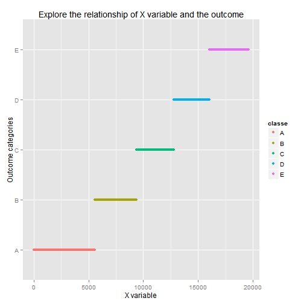
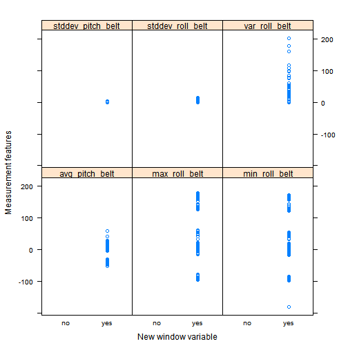
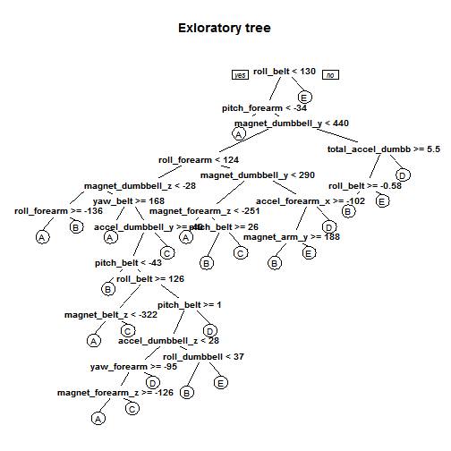

#Background of the study

Using devices such as Jawbone Up, Nike FuelBand, and Fitbit makes it possible to collect a large amount of data about personal activity relatively inexpensively. One thing that people regularly measure is how much of a particular activity they do, but they rarely quantify how well they do it. In this project, the goal is to use data from Razor inertial measurement units (IMU) mounted on the belts, gloves, arm-bands, and dumbbells of 6 participants. They were asked to perform Unilateral Dumbbell Biceps Curls in 5 different fashions: correctly (according to specifications) and incorrectly (in 4 different ways).

##Overview of the data

Before you start, set your working directory and download the training and testing data sets in it. Then, download and load the packages used in this analysis.


```r
library(ggplot2)
library(randomForest)
library(caret)
library(rpart)
library(rpart.plot)
train <- read.csv("pml-training.csv")
str(train[,1:15])
```

```
## 'data.frame':	19622 obs. of  15 variables:
##  $ X                   : int  1 2 3 4 5 6 7 8 9 10 ...
##  $ user_name           : Factor w/ 6 levels "adelmo","carlitos",..: 2 2 2 2 2 2 2 2 2 2 ...
##  $ raw_timestamp_part_1: int  1323084231 1323084231 1323084231 1323084232 1323084232 1323084232 1323084232 1323084232 1323084232 1323084232 ...
##  $ raw_timestamp_part_2: int  788290 808298 820366 120339 196328 304277 368296 440390 484323 484434 ...
##  $ cvtd_timestamp      : Factor w/ 20 levels "02/12/2011 13:32",..: 9 9 9 9 9 9 9 9 9 9 ...
##  $ new_window          : Factor w/ 2 levels "no","yes": 1 1 1 1 1 1 1 1 1 1 ...
##  $ num_window          : int  11 11 11 12 12 12 12 12 12 12 ...
##  $ roll_belt           : num  1.41 1.41 1.42 1.48 1.48 1.45 1.42 1.42 1.43 1.45 ...
##  $ pitch_belt          : num  8.07 8.07 8.07 8.05 8.07 8.06 8.09 8.13 8.16 8.17 ...
##  $ yaw_belt            : num  -94.4 -94.4 -94.4 -94.4 -94.4 -94.4 -94.4 -94.4 -94.4 -94.4 ...
##  $ total_accel_belt    : int  3 3 3 3 3 3 3 3 3 3 ...
##  $ kurtosis_roll_belt  : Factor w/ 397 levels "","-0.016850",..: 1 1 1 1 1 1 1 1 1 1 ...
##  $ kurtosis_picth_belt : Factor w/ 317 levels "","-0.021887",..: 1 1 1 1 1 1 1 1 1 1 ...
##  $ kurtosis_yaw_belt   : Factor w/ 2 levels "","#DIV/0!": 1 1 1 1 1 1 1 1 1 1 ...
##  $ skewness_roll_belt  : Factor w/ 395 levels "","-0.003095",..: 1 1 1 1 1 1 1 1 1 1 ...
```

```r
summary(train$user_name)
```

```
##   adelmo carlitos  charles   eurico   jeremy    pedro 
##     3892     3112     3536     3070     3402     2610
```

```r
summary(train$classe)
```

```
##    A    B    C    D    E 
## 5580 3797 3422 3216 3607
```

```r
prop.table(table(train$user_name, train$classe),1)
```

```
##           
##                 A      B      C      D      E
##   adelmo   0.2993 0.1994 0.1927 0.1323 0.1763
##   carlitos 0.2680 0.2217 0.1584 0.1562 0.1957
##   charles  0.2542 0.2107 0.1524 0.1816 0.2011
##   eurico   0.2818 0.1928 0.1593 0.1896 0.1765
##   jeremy   0.3460 0.1437 0.1917 0.1534 0.1652
##   pedro    0.2452 0.1935 0.1912 0.1797 0.1904
```

##Let's do some exploratory analysis

   

It is obvious that:
1. The data was ordered by the outcome category and the observations were numbered using the X variable.
3. The variable num_window defines window frames based on the date and time when each participant performed the exercise. 
4. As each participant complied to the instructions of an experienced trainer, the two window variables cannot have a strong predictive value to a non-controlled set. 
5. The new_window variable was used for calculating interval-based stats of many of the measurement features.


```r
train1 <- train[,-c(1,3,4,5,6,7)]
```

##Exploratory analysis on features

Let's explore all feature related to the Euler angles, and namely the roll, the pitch and the yaw of the four IMUs.


```r
yaw <- grep("yaw",names(train1))
summary(train1[,yaw])
```

```
##     yaw_belt      kurtosis_yaw_belt skewness_yaw_belt  max_yaw_belt  
##  Min.   :-180.0          :19216            :19216            :19216  
##  1st Qu.: -88.3   #DIV/0!:  406     #DIV/0!:  406     -1.1   :   30  
##  Median : -13.0                                       -1.4   :   29  
##  Mean   : -11.2                                       -1.2   :   26  
##  3rd Qu.:  12.9                                       -0.9   :   24  
##  Max.   : 179.0                                       -1.3   :   22  
##                                                       (Other):  275  
##   min_yaw_belt   amplitude_yaw_belt  avg_yaw_belt   stddev_yaw_belt
##         :19216          :19216      Min.   :-138    Min.   :  0    
##  -1.1   :   30   #DIV/0!:   10      1st Qu.: -88    1st Qu.:  0    
##  -1.4   :   29   0.00   :   12      Median :  -7    Median :  0    
##  -1.2   :   26   0.0000 :  384      Mean   :  -9    Mean   :  1    
##  -0.9   :   24                      3rd Qu.:  14    3rd Qu.:  1    
##  -1.3   :   22                      Max.   : 174    Max.   :177    
##  (Other):  275                      NA's   :19216   NA's   :19216  
##   var_yaw_belt      yaw_arm         avg_yaw_arm    stddev_yaw_arm 
##  Min.   :    0   Min.   :-180.00   Min.   :-173    Min.   :  0    
##  1st Qu.:    0   1st Qu.: -43.10   1st Qu.: -29    1st Qu.:  3    
##  Median :    0   Median :   0.00   Median :   0    Median : 17    
##  Mean   :  107   Mean   :  -0.62   Mean   :   2    Mean   : 22    
##  3rd Qu.:    0   3rd Qu.:  45.88   3rd Qu.:  38    3rd Qu.: 36    
##  Max.   :31183   Max.   : 180.00   Max.   : 152    Max.   :177    
##  NA's   :19216                     NA's   :19216   NA's   :19216  
##   var_yaw_arm    kurtosis_yaw_arm skewness_yaw_arm  max_yaw_arm   
##  Min.   :    0           :19216           :19216   Min.   : 4     
##  1st Qu.:    7   #DIV/0! :   11   #DIV/0! :   11   1st Qu.:29     
##  Median :  278   0.55844 :    2   -1.62032:    2   Median :34     
##  Mean   : 1056   0.65132 :    2   0.55053 :    2   Mean   :35     
##  3rd Qu.: 1295   -0.01548:    1   -0.00311:    1   3rd Qu.:41     
##  Max.   :31345   -0.01749:    1   -0.00562:    1   Max.   :65     
##  NA's   :19216   (Other) :  389   (Other) :  389   NA's   :19216  
##   min_yaw_arm    amplitude_yaw_arm  yaw_dumbbell     kurtosis_yaw_dumbbell
##  Min.   : 1      Min.   : 0        Min.   :-150.87          :19216        
##  1st Qu.: 8      1st Qu.:13        1st Qu.: -77.64   #DIV/0!:  406        
##  Median :13      Median :22        Median :  -3.32                        
##  Mean   :15      Mean   :21        Mean   :   1.67                        
##  3rd Qu.:19      3rd Qu.:29        3rd Qu.:  79.64                        
##  Max.   :38      Max.   :52        Max.   : 154.95                        
##  NA's   :19216   NA's   :19216                                            
##  skewness_yaw_dumbbell max_yaw_dumbbell min_yaw_dumbbell
##         :19216                :19216           :19216   
##  #DIV/0!:  406         -0.6   :   20    -0.6   :   20   
##                        0.2    :   19    0.2    :   19   
##                        -0.8   :   18    -0.8   :   18   
##                        -0.3   :   16    -0.3   :   16   
##                        -0.2   :   15    -0.2   :   15   
##                        (Other):  318    (Other):  318   
##  amplitude_yaw_dumbbell avg_yaw_dumbbell stddev_yaw_dumbbell
##         :19216          Min.   :-118     Min.   :  0        
##  #DIV/0!:    5          1st Qu.: -77     1st Qu.:  4        
##  0.00   :  401          Median :  -5     Median : 10        
##                         Mean   :   0     Mean   : 17        
##                         3rd Qu.:  71     3rd Qu.: 25        
##                         Max.   : 135     Max.   :107        
##                         NA's   :19216    NA's   :19216      
##  var_yaw_dumbbell  yaw_forearm     kurtosis_yaw_forearm
##  Min.   :    0    Min.   :-180.0          :19216       
##  1st Qu.:   15    1st Qu.: -68.6   #DIV/0!:  406       
##  Median :  105    Median :   0.0                       
##  Mean   :  590    Mean   :  19.2                       
##  3rd Qu.:  609    3rd Qu.: 110.0                       
##  Max.   :11468    Max.   : 180.0                       
##  NA's   :19216                                         
##  skewness_yaw_forearm max_yaw_forearm min_yaw_forearm
##         :19216               :19216          :19216  
##  #DIV/0!:  406        #DIV/0!:   84   #DIV/0!:   84  
##                       -1.2   :   32   -1.2   :   32  
##                       -1.3   :   31   -1.3   :   31  
##                       -1.4   :   24   -1.4   :   24  
##                       -1.5   :   24   -1.5   :   24  
##                       (Other):  211   (Other):  211  
##  amplitude_yaw_forearm avg_yaw_forearm stddev_yaw_forearm var_yaw_forearm
##         :19216         Min.   :-155    Min.   :  0        Min.   :    0  
##  #DIV/0!:   84         1st Qu.: -26    1st Qu.:  1        1st Qu.:    0  
##  0.00   :  322         Median :   0    Median : 25        Median :  612  
##                        Mean   :  18    Mean   : 45        Mean   : 4640  
##                        3rd Qu.:  86    3rd Qu.: 86        3rd Qu.: 7368  
##                        Max.   : 169    Max.   :198        Max.   :39009  
##                        NA's   :19216   NA's   :19216      NA's   :19216
```

```r
remove_var1 <- c("kurtosis_yaw_belt","skewness_yaw_belt","amplitude_yaw_belt","kurtosis_yaw_dumbbell","skewness_yaw_dumbbell","amplitude_yaw_dumbbell","kurtosis_yaw_forearm","skewness_yaw_forearm","amplitude_yaw_forearm")
```

It looks like some features comprise only of zero or error values.Prepare to remove them. Do the same processing with the roll, pitch, accel, gyro and magnet features.


```r
roll <- grep("roll",names(train1))
summary(train1[,roll])
remove_var2<- c("kurtosis_roll_belt","skewness_roll_belt","skewness_roll_belt.1", "kurtosis_roll_arm", "skewness_roll_arm", "kurtosis_roll_dumbbell", "skewness_roll_dumbbell", "kurtosis_roll_forearm", "skewness_roll_forearm")

pitch <- grep("pitch",names(train1))
summary(train1[,pitch])

accel <- grep("accel",names(train1))
summary(train1[,accel])

gyro <- grep("gyro",names(train1))
summary(train1[,gyro])

magnet <- grep("magnet",names(train1))
summary(train1[,magnet])
```

Remove all non-informative features.


```r
remove_vars<- c(remove_var1, remove_var2)
remove <- names(train1) %in% remove_vars
train2 <- train1[!remove]      ##136 variables left
```

###Investigate for near zero covariates related to each wearable sensor

Let's split all features based on the part of the body/equipment where the IMU is mounted.

```r
belt_vars <- grep("belt",names(train2))
forearm_vars<-grep("forearm",names(train2))
arm_vars<- grep("_arm",names(train2))
dumbbell_vars <-grep("dumbbell",names(train2))
```

- for the belt:


```r
nearZeroVar(train2[,belt_vars], saveMetric=T)
nz <-nearZeroVar(train2[,belt_vars], saveMetric=F)
nzbelt <- names(train2[,belt_vars][,nz])
```

- for the glove:


```r
nearZeroVar(train2[,forearm_vars], saveMetric=T)
nz <-nearZeroVar(train2[,forearm_vars], saveMetric=F)
nzforearm <-names(train2[,forearm_vars][,nz])
```

 - for the arm-band:
 

```r
nearZeroVar(train2[,arm_vars], saveMetric=T)
nz <-nearZeroVar(train2[,arm_vars], saveMetric=F)
nzarm <-names(train2[,arm_vars][,nz])
```

- for the dumbbell:


```r
nearZeroVar(train2[,dumbbell_vars], saveMetric=T)
nz <-nearZeroVar(train2[,dumbbell_vars], saveMetric=F)
nzdumbbell <-names(train2[,dumbbell_vars][,nz])
```

- remove all near-zero features:


```r
remove_vars<- c(nzbelt, nzforearm, nzarm, nzdumbbell)
remove <- names(train2) %in% remove_vars
train3 <- train2[!remove]    ##95 variables left
```

###Remove covariates with too strong correlation 

As the body moves, the IMUs measure both the extent and the acceleration of each movement using Euler angles, the angular momentum (by the gyroscope) and the accelerator. This creates high correlation among many of the variables. This will bias the coefficients, so I use a two step process to remove some of the most highly correlated covariates.


```r
M <- abs(cor(train3[,c(2:94)]))
diag(M)<- 0
which(M>0.95, arr.ind=T)
```

```
##                  row col
## total_accel_belt   4   1
## accel_belt_z      26   1
## accel_belt_x      24   2
## roll_belt          1   4
## accel_belt_z      26   4
## pitch_belt         2  24
## roll_belt          1  26
## total_accel_belt   4  26
## gyros_dumbbell_z  70  68
## gyros_dumbbell_x  68  70
```

```r
remove_vars <- c("accel_belt_x","accel_belt_z", "total_accel_belt","gyros_dumbbell_z")
remove <- names(train3) %in% remove_vars
train4 <- train3[!remove]     ##91 variables left

M <- abs(cor(train4[,c(2:90)]))
diag(M)<- 0
which(M>0.90, arr.ind=T)
```

```
##                  row col
## accel_belt_y      23   1
## roll_belt          1  23
## gyros_arm_y       33  32
## gyros_arm_x       32  33
## gyros_forearm_z   83  65
## gyros_dumbbell_x  65  83
```

```r
remove_vars <- c("accel_belt_y","gyros_arm_y", "gyros_dumbbell_x")
remove <- names(train4) %in% remove_vars
train5 <- train4[!remove]    ##88 variables left
```

The strategy for which variables to remove is to minimize the number of variables removed while breaking all highly correlated pairs. I did this twice using thresholds of correlation 0.95 and 0.9. 

##Let's build the model

###Feature Selection

87 covariates are still too many for a robust and interpretable model. Let's try to reduce them by using a classification tree algorithm.


```r
exploretree = rpart(classe ~ ., data=train5, method="class",minbucket=20)
prp(exploretree, cex=0.8, main="Exloratory tree")
```

 

```r
summary(exploretree)  ##29 predictors
```

Check the summary of the model and select all predictors with importance more than 1 (18 out of 29).

###Define cross-validation experiment


```r
fitControl = trainControl( method = "cv", number = 10 )
cartGrid = expand.grid( .cp = (1:50)*0.01) 

train(classe ~ user_name + 
      roll_belt + pitch_belt + yaw_belt + magnet_belt_x + magnet_belt_y +
      pitch_forearm + accel_forearm_x + roll_forearm + yaw_forearm + magnet_forearm_y + 
      magnet_arm_y + 
      magnet_dumbbell_y + accel_dumbbell_y + total_accel_dumbbell + magnet_dumbbell_z + 
      roll_dumbbell + accel_dumbbell_z, 
      data = train5, method = "rpart", trControl = fitControl, 
      tuneGrid = cartGrid)
```

I did 10-fold cross validation with resampling. The best performing parameter is cp=0.01 with an accuracy of 0.73.

###Try a CART Model

The user_name variable seemed important in the exploratory CART model. Although user-specific characteristics could probably be important for the way the exercise is performed, this variable wouldn't be useful on other samples as there are only 6 subjects. Let's run the model once again without it.


```r
set.seed(122)
exploretree1 = rpart( classe ~ 
      roll_belt + pitch_belt + yaw_belt + magnet_belt_x + magnet_belt_y +
      pitch_forearm + accel_forearm_x + roll_forearm + yaw_forearm + magnet_forearm_y + 
      magnet_arm_y + 
      magnet_dumbbell_y + accel_dumbbell_y + total_accel_dumbbell + magnet_dumbbell_z + 
      roll_dumbbell + accel_dumbbell_z,
      data = train, method="class", control=rpart.control(cp = 0.01))
```

Calculate the CART model accuracy (for the lack of test data, I am using the train data again).


```r
PredictTree = predict(exploretree1, newdata = train, type = "class")
table(train$classe, PredictTree)
```

```
##    PredictTree
##        A    B    C    D    E
##   A 5009  178  114  183   96
##   B  708 2414  244  246  185
##   C  262  310 2567  193   90
##   D  227  277  440 2045  227
##   E  154  314  348  185 2606
```


The weighted accuracy for the five outcome classes is 0.7462, which is a little better than the previous model. The out-of-sample error will obviously be larger.

### Build random forest model


```r
set.seed(133)
exploreforest = randomForest(classe ~ 
       roll_belt + pitch_belt + yaw_belt + magnet_belt_x + magnet_belt_y +
       pitch_forearm + accel_forearm_x + roll_forearm + yaw_forearm + magnet_forearm_y + 
       magnet_arm_y + 
       magnet_dumbbell_y + accel_dumbbell_y + total_accel_dumbbell + magnet_dumbbell_z + 
       roll_dumbbell + accel_dumbbell_z,
       data = train, ntree=10, nodesize=25)

exploreforest$confusion
```

```
##      A    B    C    D    E class.error
## A 5415   57   20   23   10     0.01991
## B  142 3460   92   33   29     0.07881
## C   40  143 3122   60   22     0.07824
## D   30   57  103 2961   28     0.06858
## E   18   77   41   61 3366     0.05529
```

```r
wa2<-(5415+3460+3122+2961+3366)/19622
```

The random forest model did better - 0.9338 for the weighted accuracy. Let's make predictions again on the training set.


```r
set.seed(123)
PredictForest = predict(exploreforest, newdata=train)
table(train$classe, PredictForest)
```

```
##    PredictForest
##        A    B    C    D    E
##   A 5551   22    5    1    1
##   B   33 3734   25    5    0
##   C    2   35 3359   23    3
##   D    2    4   40 3165    5
##   E    1    8    8   19 3571
```

And the in-sample accuracy estimates:


```r
(5551+3734+3359+3165+3571)/19622  ##Weighted Accuracy
```

```
## [1] 0.9877
```

```r
5551/(5551+22+5+1+1)              ## Class A
```

```
## [1] 0.9948
```

```r
3734/(3734+33+25+5+0)             ## Class B
```

```
## [1] 0.9834
```

```r
3359/(3359+2+35+23+3)             ## Class C
```

```
## [1] 0.9816
```

```r
3365/(3365+2+4+40+5)              ## Class D
```

```
## [1] 0.9851
```

```r
3571/(3571+1+8+8+19)              ## Class E
```

```
## [1] 0.99
```

Again, the accuracy on a different set is expected to be lower. In fact, the accuracy on the test set of this model is 0.95.


```r
test<-read.csv("pml-testing.csv")
PredictForest1 = predict(exploreforest, newdata=test)
table(PredictForest1)
```

```
## PredictForest1
## A B C D E 
## 7 9 0 1 3
```

```r
PredictForest1
```

```
##  1  2  3  4  5  6  7  8  9 10 11 12 13 14 15 16 17 18 19 20 
##  B  A  B  A  A  E  D  B  A  A  B  B  B  A  E  E  A  B  B  B 
## Levels: A B C D E
```

```r
19/20
```

```
## [1] 0.95
```

In the end, it is worth noting that when I added the user_name variable to the random forest model I was able to predict correctly all 20 test cases. 
