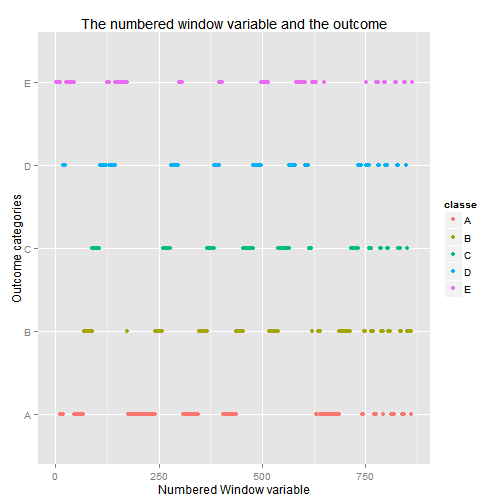

#Background of the study

Using devices such as Jawbone Up, Nike FuelBand, and Fitbit makes it possible to collect a large amount of data about personal activity relatively inexpensively. These type of devices are part of the quantified self movement aiming to improve subjects' health, to find patterns in their behavior, or because they enjoy playing with technology. One thing that people regularly measure is how much of a particular activity they do, but they rarely quantify how well they do it. In this project, the goal is to use data from Razor inertial measurement units (IMU) mounted on the belts, gloves, arm-bands, and dumbells of 6 participants. They were asked to perform Unilateral Dumbbell Biceps Curls in 5 different fashions: correctly (according to specifications) and incorrectly (in 4 different ways).

#Overview of the data

Before you start modelling, take a look at the data. Don't forget to set your working directory and to download the training and testing data sets in it.


```r
library(ggplot2)
library(randomForest)
library(caret)
train <- read.csv("pml-training.csv")
str(train[,1:15])
```

```
## 'data.frame':	19622 obs. of  15 variables:
##  $ X                   : int  1 2 3 4 5 6 7 8 9 10 ...
##  $ user_name           : Factor w/ 6 levels "adelmo","carlitos",..: 2 2 2 2 2 2 2 2 2 2 ...
##  $ raw_timestamp_part_1: int  1323084231 1323084231 1323084231 1323084232 1323084232 1323084232 1323084232 1323084232 1323084232 1323084232 ...
##  $ raw_timestamp_part_2: int  788290 808298 820366 120339 196328 304277 368296 440390 484323 484434 ...
##  $ cvtd_timestamp      : Factor w/ 20 levels "02/12/2011 13:32",..: 9 9 9 9 9 9 9 9 9 9 ...
##  $ new_window          : Factor w/ 2 levels "no","yes": 1 1 1 1 1 1 1 1 1 1 ...
##  $ num_window          : int  11 11 11 12 12 12 12 12 12 12 ...
##  $ roll_belt           : num  1.41 1.41 1.42 1.48 1.48 1.45 1.42 1.42 1.43 1.45 ...
##  $ pitch_belt          : num  8.07 8.07 8.07 8.05 8.07 8.06 8.09 8.13 8.16 8.17 ...
##  $ yaw_belt            : num  -94.4 -94.4 -94.4 -94.4 -94.4 -94.4 -94.4 -94.4 -94.4 -94.4 ...
##  $ total_accel_belt    : int  3 3 3 3 3 3 3 3 3 3 ...
##  $ kurtosis_roll_belt  : Factor w/ 397 levels "","-0.016850",..: 1 1 1 1 1 1 1 1 1 1 ...
##  $ kurtosis_picth_belt : Factor w/ 317 levels "","-0.021887",..: 1 1 1 1 1 1 1 1 1 1 ...
##  $ kurtosis_yaw_belt   : Factor w/ 2 levels "","#DIV/0!": 1 1 1 1 1 1 1 1 1 1 ...
##  $ skewness_roll_belt  : Factor w/ 395 levels "","-0.003095",..: 1 1 1 1 1 1 1 1 1 1 ...
```

```r
summary(train$user_name)
```

```
##   adelmo carlitos  charles   eurico   jeremy    pedro 
##     3892     3112     3536     3070     3402     2610
```

```r
summary(train$classe)
```

```
##    A    B    C    D    E 
## 5580 3797 3422 3216 3607
```

```r
prop.table(table(train$user_name, train$classe),1)
```

```
##           
##                 A      B      C      D      E
##   adelmo   0.2993 0.1994 0.1927 0.1323 0.1763
##   carlitos 0.2680 0.2217 0.1584 0.1562 0.1957
##   charles  0.2542 0.2107 0.1524 0.1816 0.2011
##   eurico   0.2818 0.1928 0.1593 0.1896 0.1765
##   jeremy   0.3460 0.1437 0.1917 0.1534 0.1652
##   pedro    0.2452 0.1935 0.1912 0.1797 0.1904
```

It looks like each subject does the execise correctly in about 24-34% of the time and repeats one of the 4 possible mistakes in about 13-20% of the time.

##Let's do some exploratory analysis

   

It is obvious that:
1. variable X is directly correlated with the outcome.
2. it looks like the data was ordered by the outcome category and the observations were numbered using the X variable. 
3. the categorical variable # of the window shows that the window frames were constructed based on the time series within which each participant performed the execises. 
4. as each participant complied to the instructions of an experienced trainer, the two window variables cannot have a strong predictive value to an non-controlled set. 
5. the new window variable is strongly correlated with many of the measurement features on the IMU readings.

Therefore, we can safely get rid of them, preserving only a time variable that we might need for cross validation.


```r
train$time <-as.POSIXct(train$raw_timestamp_part_1, origin="1970-01-01")
train <- train[,-c(1,3,4,5,7)]
```

###Exploratory analysis on features

Let's explore all feature related to the Euler angles, and namely the roll, the pitch and the yaw of the four IMUs.


```r
yaw <- grep("yaw",names(train))
summary(train[,yaw])
```

```
##     yaw_belt      kurtosis_yaw_belt skewness_yaw_belt  max_yaw_belt  
##  Min.   :-180.0          :19216            :19216            :19216  
##  1st Qu.: -88.3   #DIV/0!:  406     #DIV/0!:  406     -1.1   :   30  
##  Median : -13.0                                       -1.4   :   29  
##  Mean   : -11.2                                       -1.2   :   26  
##  3rd Qu.:  12.9                                       -0.9   :   24  
##  Max.   : 179.0                                       -1.3   :   22  
##                                                       (Other):  275  
##   min_yaw_belt   amplitude_yaw_belt  avg_yaw_belt   stddev_yaw_belt
##         :19216          :19216      Min.   :-138    Min.   :  0    
##  -1.1   :   30   #DIV/0!:   10      1st Qu.: -88    1st Qu.:  0    
##  -1.4   :   29   0.00   :   12      Median :  -7    Median :  0    
##  -1.2   :   26   0.0000 :  384      Mean   :  -9    Mean   :  1    
##  -0.9   :   24                      3rd Qu.:  14    3rd Qu.:  1    
##  -1.3   :   22                      Max.   : 174    Max.   :177    
##  (Other):  275                      NA's   :19216   NA's   :19216  
##   var_yaw_belt      yaw_arm         avg_yaw_arm    stddev_yaw_arm 
##  Min.   :    0   Min.   :-180.00   Min.   :-173    Min.   :  0    
##  1st Qu.:    0   1st Qu.: -43.10   1st Qu.: -29    1st Qu.:  3    
##  Median :    0   Median :   0.00   Median :   0    Median : 17    
##  Mean   :  107   Mean   :  -0.62   Mean   :   2    Mean   : 22    
##  3rd Qu.:    0   3rd Qu.:  45.88   3rd Qu.:  38    3rd Qu.: 36    
##  Max.   :31183   Max.   : 180.00   Max.   : 152    Max.   :177    
##  NA's   :19216                     NA's   :19216   NA's   :19216  
##   var_yaw_arm    kurtosis_yaw_arm skewness_yaw_arm  max_yaw_arm   
##  Min.   :    0           :19216           :19216   Min.   : 4     
##  1st Qu.:    7   #DIV/0! :   11   #DIV/0! :   11   1st Qu.:29     
##  Median :  278   0.55844 :    2   -1.62032:    2   Median :34     
##  Mean   : 1056   0.65132 :    2   0.55053 :    2   Mean   :35     
##  3rd Qu.: 1295   -0.01548:    1   -0.00311:    1   3rd Qu.:41     
##  Max.   :31345   -0.01749:    1   -0.00562:    1   Max.   :65     
##  NA's   :19216   (Other) :  389   (Other) :  389   NA's   :19216  
##   min_yaw_arm    amplitude_yaw_arm  yaw_dumbbell     kurtosis_yaw_dumbbell
##  Min.   : 1      Min.   : 0        Min.   :-150.87          :19216        
##  1st Qu.: 8      1st Qu.:13        1st Qu.: -77.64   #DIV/0!:  406        
##  Median :13      Median :22        Median :  -3.32                        
##  Mean   :15      Mean   :21        Mean   :   1.67                        
##  3rd Qu.:19      3rd Qu.:29        3rd Qu.:  79.64                        
##  Max.   :38      Max.   :52        Max.   : 154.95                        
##  NA's   :19216   NA's   :19216                                            
##  skewness_yaw_dumbbell max_yaw_dumbbell min_yaw_dumbbell
##         :19216                :19216           :19216   
##  #DIV/0!:  406         -0.6   :   20    -0.6   :   20   
##                        0.2    :   19    0.2    :   19   
##                        -0.8   :   18    -0.8   :   18   
##                        -0.3   :   16    -0.3   :   16   
##                        -0.2   :   15    -0.2   :   15   
##                        (Other):  318    (Other):  318   
##  amplitude_yaw_dumbbell avg_yaw_dumbbell stddev_yaw_dumbbell
##         :19216          Min.   :-118     Min.   :  0        
##  #DIV/0!:    5          1st Qu.: -77     1st Qu.:  4        
##  0.00   :  401          Median :  -5     Median : 10        
##                         Mean   :   0     Mean   : 17        
##                         3rd Qu.:  71     3rd Qu.: 25        
##                         Max.   : 135     Max.   :107        
##                         NA's   :19216    NA's   :19216      
##  var_yaw_dumbbell  yaw_forearm     kurtosis_yaw_forearm
##  Min.   :    0    Min.   :-180.0          :19216       
##  1st Qu.:   15    1st Qu.: -68.6   #DIV/0!:  406       
##  Median :  105    Median :   0.0                       
##  Mean   :  590    Mean   :  19.2                       
##  3rd Qu.:  609    3rd Qu.: 110.0                       
##  Max.   :11468    Max.   : 180.0                       
##  NA's   :19216                                         
##  skewness_yaw_forearm max_yaw_forearm min_yaw_forearm
##         :19216               :19216          :19216  
##  #DIV/0!:  406        #DIV/0!:   84   #DIV/0!:   84  
##                       -1.2   :   32   -1.2   :   32  
##                       -1.3   :   31   -1.3   :   31  
##                       -1.4   :   24   -1.4   :   24  
##                       -1.5   :   24   -1.5   :   24  
##                       (Other):  211   (Other):  211  
##  amplitude_yaw_forearm avg_yaw_forearm stddev_yaw_forearm var_yaw_forearm
##         :19216         Min.   :-155    Min.   :  0        Min.   :    0  
##  #DIV/0!:   84         1st Qu.: -26    1st Qu.:  1        1st Qu.:    0  
##  0.00   :  322         Median :   0    Median : 25        Median :  612  
##                        Mean   :  18    Mean   : 45        Mean   : 4640  
##                        3rd Qu.:  86    3rd Qu.: 86        3rd Qu.: 7368  
##                        Max.   : 169    Max.   :198        Max.   :39009  
##                        NA's   :19216   NA's   :19216      NA's   :19216
```

```r
remove_var1 <- c("kurtosis_yaw_belt","skewness_yaw_belt","amplitude_yaw_belt","kurtosis_yaw_dumbbell","skewness_yaw_dumbbell","amplitude_yaw_dumbbell","kurtosis_yaw_forearm","skewness_yaw_forearm","amplitude_yaw_forearm")
```

It looks like some features comprise only of zero or error values.Prepare to remove them. Do the same processing with the roll, pitch, accel, gyro and magnet features.


```r
roll <- grep("roll",names(train))
summary(train[,roll])
remove_var2<- c("kurtosis_roll_belt","skewness_roll_belt","skewness_roll_belt.1",
                "kurtosis_roll_arm","skewness_roll_arm","kurtosis_roll_dumbbell",
      "skewness_roll_dumbbell","kurtosis_roll_forearm","skewness_roll_forearm")

pitch <- grep("pitch",names(train))
summary(train[,pitch])

accel <- grep("accel",names(train))
summary(train[,accel])

gyro <- grep("gyro",names(train))
summary(train[,gyro])

magnet <- grep("magnet",names(train))
summary(train[,magnet])
```

Remove all non-informative features.


```r
remove_vars<- c(remove_var1, remove_var2)
remove <- names(train) %in% remove_vars
train <- train[!remove]
```

###Investigate for near zero covariates related to each wearable sensor

Let's split all features based on the part of the body/equipement where the IMU is mounted.

```r
belt_vars <- grep("belt",names(train))
forearm_vars<-grep("forearm",names(train))
arm_vars<- grep("_arm",names(train))
dumbbell_vars <-grep("dumbbell",names(train))
```

- for the belt:


```r
nearZeroVar(train[,belt_vars], saveMetric=T)
```

```
##                      freqRatio percentUnique zeroVar   nzv
## roll_belt                1.102       6.77811   FALSE FALSE
## pitch_belt               1.036       9.37723   FALSE FALSE
## yaw_belt                 1.058       9.97350   FALSE FALSE
## total_accel_belt         1.063       0.14779   FALSE FALSE
## kurtosis_picth_belt    600.500       1.61553   FALSE  TRUE
## max_roll_belt            1.000       0.99378   FALSE FALSE
## max_picth_belt           1.538       0.11212   FALSE FALSE
## max_yaw_belt           640.533       0.34655   FALSE  TRUE
## min_roll_belt            1.000       0.93772   FALSE FALSE
## min_pitch_belt           2.192       0.08154   FALSE FALSE
## min_yaw_belt           640.533       0.34655   FALSE  TRUE
## amplitude_roll_belt      1.290       0.75426   FALSE FALSE
## amplitude_pitch_belt     3.042       0.06625   FALSE FALSE
## var_total_accel_belt     1.427       0.33126   FALSE FALSE
## avg_roll_belt            1.067       0.97340   FALSE FALSE
## stddev_roll_belt         1.039       0.35165   FALSE FALSE
## var_roll_belt            1.615       0.48925   FALSE FALSE
## avg_pitch_belt           1.375       1.09061   FALSE FALSE
## stddev_pitch_belt        1.161       0.21914   FALSE FALSE
## var_pitch_belt           1.308       0.32107   FALSE FALSE
## avg_yaw_belt             1.200       1.22312   FALSE FALSE
## stddev_yaw_belt          1.694       0.29559   FALSE FALSE
## var_yaw_belt             1.500       0.73897   FALSE FALSE
## gyros_belt_x             1.059       0.71348   FALSE FALSE
## gyros_belt_y             1.144       0.35165   FALSE FALSE
## gyros_belt_z             1.066       0.86128   FALSE FALSE
## accel_belt_x             1.055       0.83580   FALSE FALSE
## accel_belt_y             1.114       0.72877   FALSE FALSE
## accel_belt_z             1.079       1.52380   FALSE FALSE
## magnet_belt_x            1.090       1.66650   FALSE FALSE
## magnet_belt_y            1.100       1.51870   FALSE FALSE
## magnet_belt_z            1.006       2.32902   FALSE FALSE
```

```r
nz <-nearZeroVar(train[,belt_vars], saveMetric=F)
nzbelt <- names(train[,belt_vars][,nz])
```

- for the glove:


```r
nearZeroVar(train[,forearm_vars], saveMetric=T)
```

```
##                         freqRatio percentUnique zeroVar   nzv
## roll_forearm               11.589       11.0896   FALSE FALSE
## pitch_forearm              65.983       14.8558   FALSE FALSE
## yaw_forearm                15.323       10.1468   FALSE FALSE
## kurtosis_picth_forearm    226.071        1.6461   FALSE  TRUE
## skewness_pitch_forearm    226.071        1.6257   FALSE  TRUE
## max_roll_forearm           27.667        1.3811   FALSE  TRUE
## max_picth_forearm           2.964        0.7899   FALSE FALSE
## max_yaw_forearm           228.762        0.2293   FALSE  TRUE
## min_roll_forearm           27.667        1.3709   FALSE  TRUE
## min_pitch_forearm           2.862        0.8715   FALSE FALSE
## min_yaw_forearm           228.762        0.2293   FALSE  TRUE
## amplitude_roll_forearm     20.750        1.4932   FALSE  TRUE
## amplitude_pitch_forearm     3.269        0.9326   FALSE FALSE
## total_accel_forearm         1.129        0.3567   FALSE FALSE
## var_accel_forearm           3.500        2.0334   FALSE FALSE
## avg_roll_forearm           27.667        1.6410   FALSE  TRUE
## stddev_roll_forearm        87.000        1.6308   FALSE  TRUE
## var_roll_forearm           87.000        1.6308   FALSE  TRUE
## avg_pitch_forearm          83.000        1.6512   FALSE  TRUE
## stddev_pitch_forearm       41.500        1.6461   FALSE  TRUE
## var_pitch_forearm          83.000        1.6512   FALSE  TRUE
## avg_yaw_forearm            83.000        1.6512   FALSE  TRUE
## stddev_yaw_forearm         85.000        1.6410   FALSE  TRUE
## var_yaw_forearm            85.000        1.6410   FALSE  TRUE
## gyros_forearm_x             1.059        1.5187   FALSE FALSE
## gyros_forearm_y             1.037        3.7764   FALSE FALSE
## gyros_forearm_z             1.123        1.5646   FALSE FALSE
## accel_forearm_x             1.126        4.0465   FALSE FALSE
## accel_forearm_y             1.059        5.1116   FALSE FALSE
## accel_forearm_z             1.006        2.9559   FALSE FALSE
## magnet_forearm_x            1.012        7.7668   FALSE FALSE
## magnet_forearm_y            1.247        9.5403   FALSE FALSE
## magnet_forearm_z            1.000        8.5771   FALSE FALSE
```

```r
nz <-nearZeroVar(train[,forearm_vars], saveMetric=F)
nzforearm <-names(train[,forearm_vars][,nz])
```

 - for the arm-band:
 

```r
nearZeroVar(train[,arm_vars], saveMetric=T)
```

```
##                     freqRatio percentUnique zeroVar   nzv
## roll_arm               52.338       13.5256   FALSE FALSE
## pitch_arm              87.256       15.7323   FALSE FALSE
## yaw_arm                33.029       14.6570   FALSE FALSE
## total_accel_arm         1.025        0.3364   FALSE FALSE
## var_accel_arm           5.500        2.0130   FALSE FALSE
## avg_roll_arm           77.000        1.6818   FALSE  TRUE
## stddev_roll_arm        77.000        1.6818   FALSE  TRUE
## var_roll_arm           77.000        1.6818   FALSE  TRUE
## avg_pitch_arm          77.000        1.6818   FALSE  TRUE
## stddev_pitch_arm       77.000        1.6818   FALSE  TRUE
## var_pitch_arm          77.000        1.6818   FALSE  TRUE
## avg_yaw_arm            77.000        1.6818   FALSE  TRUE
## stddev_yaw_arm         80.000        1.6665   FALSE  TRUE
## var_yaw_arm            80.000        1.6665   FALSE  TRUE
## gyros_arm_x             1.016        3.2769   FALSE FALSE
## gyros_arm_y             1.454        1.9162   FALSE FALSE
## gyros_arm_z             1.111        1.2639   FALSE FALSE
## accel_arm_x             1.017        3.9598   FALSE FALSE
## accel_arm_y             1.140        2.7367   FALSE FALSE
## accel_arm_z             1.128        4.0363   FALSE FALSE
## magnet_arm_x            1.000        6.8240   FALSE FALSE
## magnet_arm_y            1.057        4.4440   FALSE FALSE
## magnet_arm_z            1.036        6.4468   FALSE FALSE
## kurtosis_picth_arm    240.200        1.6716   FALSE  TRUE
## kurtosis_yaw_arm     1746.909        2.0130   FALSE  TRUE
## skewness_pitch_arm    240.200        1.6716   FALSE  TRUE
## skewness_yaw_arm     1746.909        2.0130   FALSE  TRUE
## max_roll_arm           25.667        1.4779   FALSE  TRUE
## max_picth_arm          12.833        1.3403   FALSE FALSE
## max_yaw_arm             1.227        0.2599   FALSE FALSE
## min_roll_arm           19.250        1.4168   FALSE  TRUE
## min_pitch_arm          19.250        1.4779   FALSE  TRUE
## min_yaw_arm             1.000        0.1937   FALSE FALSE
## amplitude_roll_arm     25.667        1.5595   FALSE  TRUE
## amplitude_pitch_arm    20.000        1.4983   FALSE  TRUE
## amplitude_yaw_arm       1.037        0.2599   FALSE FALSE
```

```r
nz <-nearZeroVar(train[,arm_vars], saveMetric=F)
nzarm <-names(train[,arm_vars][,nz])
```

- for the dumbbell:


```r
nearZeroVar(train[,dumbbell_vars], saveMetric=T)
```

```
##                          freqRatio percentUnique zeroVar   nzv
## roll_dumbbell                1.022       83.7835   FALSE FALSE
## pitch_dumbbell               2.277       81.2252   FALSE FALSE
## yaw_dumbbell                 1.132       83.1414   FALSE FALSE
## kurtosis_picth_dumbbell   9608.000        2.0436   FALSE  TRUE
## skewness_pitch_dumbbell   9608.000        2.0487   FALSE  TRUE
## max_roll_dumbbell            1.000        1.7226   FALSE FALSE
## max_picth_dumbbell           1.333        1.7277   FALSE FALSE
## max_yaw_dumbbell           960.800        0.3720   FALSE  TRUE
## min_roll_dumbbell            1.000        1.6920   FALSE FALSE
## min_pitch_dumbbell           1.667        1.8143   FALSE FALSE
## min_yaw_dumbbell           960.800        0.3720   FALSE  TRUE
## amplitude_roll_dumbbell      8.000        1.9723   FALSE FALSE
## amplitude_pitch_dumbbell     8.000        1.9519   FALSE FALSE
## total_accel_dumbbell         1.073        0.2191   FALSE FALSE
## var_accel_dumbbell           6.000        1.9570   FALSE FALSE
## avg_roll_dumbbell            1.000        2.0232   FALSE FALSE
## stddev_roll_dumbbell        16.000        1.9927   FALSE FALSE
## var_roll_dumbbell           16.000        1.9927   FALSE FALSE
## avg_pitch_dumbbell           1.000        2.0232   FALSE FALSE
## stddev_pitch_dumbbell       16.000        1.9927   FALSE FALSE
## var_pitch_dumbbell          16.000        1.9927   FALSE FALSE
## avg_yaw_dumbbell             1.000        2.0232   FALSE FALSE
## stddev_yaw_dumbbell         16.000        1.9927   FALSE FALSE
## var_yaw_dumbbell            16.000        1.9927   FALSE FALSE
## gyros_dumbbell_x             1.003        1.2282   FALSE FALSE
## gyros_dumbbell_y             1.265        1.4168   FALSE FALSE
## gyros_dumbbell_z             1.060        1.0498   FALSE FALSE
## accel_dumbbell_x             1.018        2.1659   FALSE FALSE
## accel_dumbbell_y             1.053        2.3749   FALSE FALSE
## accel_dumbbell_z             1.133        2.0895   FALSE FALSE
## magnet_dumbbell_x            1.098        5.7486   FALSE FALSE
## magnet_dumbbell_y            1.198        4.3013   FALSE FALSE
## magnet_dumbbell_z            1.021        3.4451   FALSE FALSE
```

```r
nz <-nearZeroVar(train[,dumbbell_vars], saveMetric=F)
nzdumbbell <-names(train[,dumbbell_vars][,nz])
```

